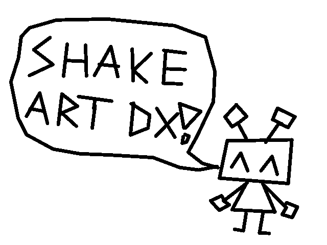
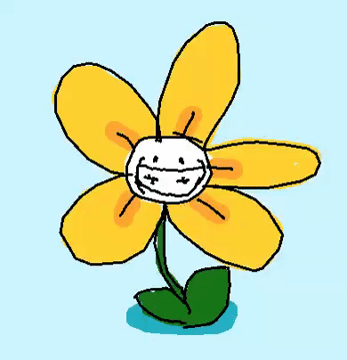

Shake Art Deluxe
?
2022-01-23
no_meta.html
link
[Open source](https://github.com/parlajatwit/shake-art-deluxe) art tool created in GameMaker Studio 2   
[playable here](https://studionokoi.itch.io/shake-art-deluxe)  

The lines are vectors where each drawn point is given a random position every n frames   
Currently, there are around 500 daily active users, with around 650k total visits across itch.io and Newgrounds.   
I'm working on a mobile version in my spare time.   
You can find community art examples [here](https://studionokoi.itch.io/shake-art-deluxe/comments)  
  

